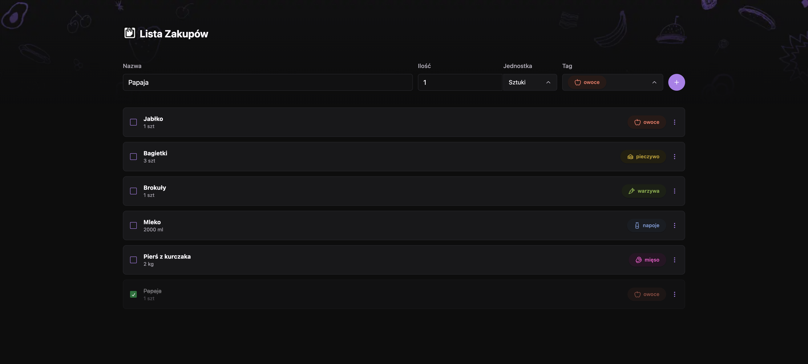
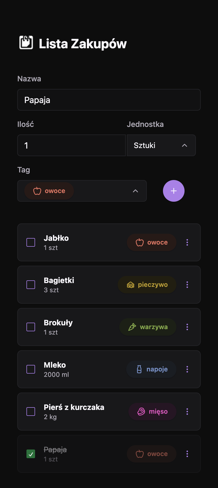
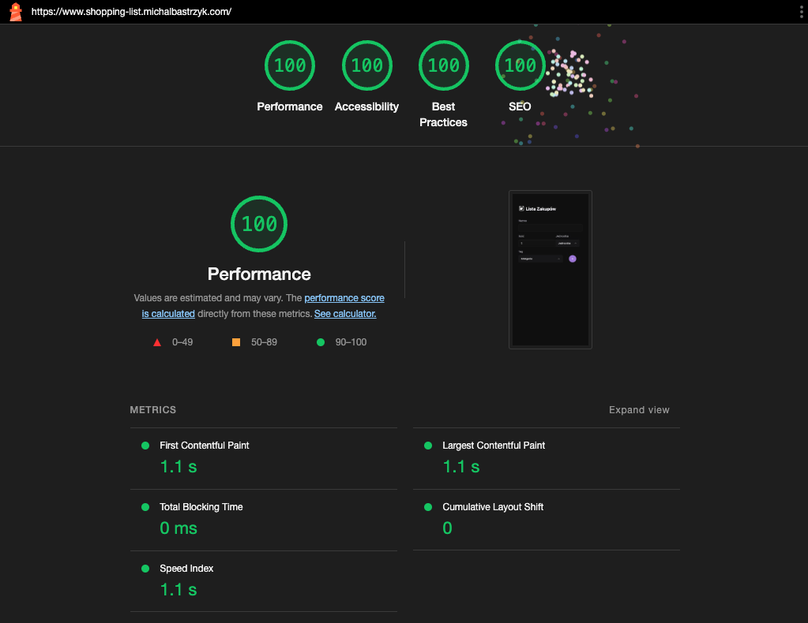

# Shopping List App

  

## Overview

The Shopping List App is a beautifully designed web application that allows users to create and manage their shopping lists efficiently. It is built using React, Typescript, TailwindCSS, and radix-ui, combining the power of these technologies to provide I, as the developer, with a user-friendly and visually appealing experience.

## Features

- **Intuitive Design**: The app features a nice-looking design inspired by [this Figma design](https://www.figma.com/community/file/1276169043084346929/lista-de-compras-desafio-34), ensuring an enjoyable and visually pleasing user interface.

- **User-Friendly Interface**: The interface is designed to be simple and easy to navigate, making it convenient for users of all levels.

- **Responsive Design**: The app is responsive, ensuring a seamless experience on various devices, including mobile phones and tablets.

  

- **Type-safe with Typescript**: The use of Typescript guarantees type safety and helps me, as the developer, catch errors early in the development process.

- **Styling with TailwindCSS**: The app's styling is powered by TailwindCSS, making it highly customizable and visually appealing.

- **Accessible Components**: The app uses radix-ui components to ensure accessibility and improve the user experience for all users.

- **100s in Lighthouse**: Achieves perfect scores in Lighthouse, ensuring top performance, accessibility, and best practices.

  

## Getting Started

To get started with the Shopping List App, follow these steps:

1. Clone the repository to your local machine.

2. Install the necessary dependencies using `npm install`.

3. Run the app locally using `npm start`.

4. Open your web browser and visit `http://localhost:3000` to start using the app.

## Contributing

Contributions are welcome! 

## License

This project is licensed under the MIT License. See the [LICENSE](LICENSE) file for more details.

## Acknowledgements

I would like to give a special shoutout to the designer of the app's beautiful UI, which was inspired by [this Figma design](https://www.figma.com/community/file/1276169043084346929/lista-de-compras-desafio-34).

Happy shopping!
